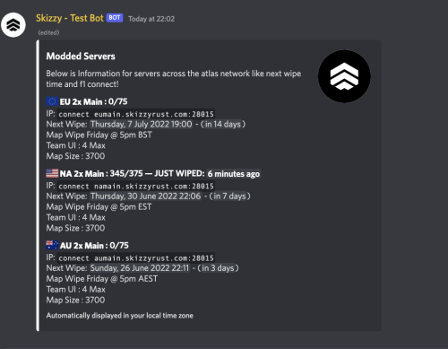
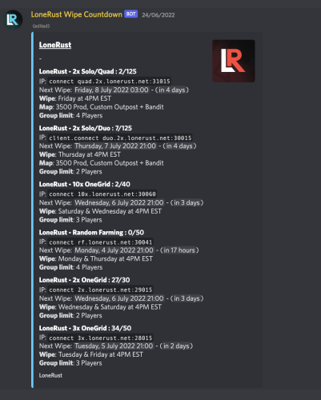
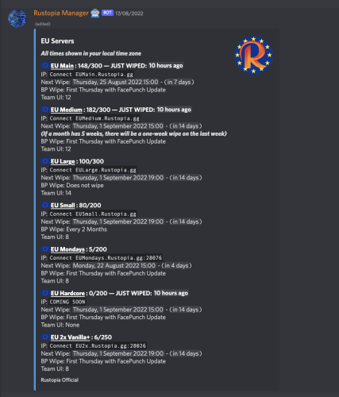

# Rust Wipe Countdown Bot

A Python Discord bot for managing Rust server wipe schedules and publishing live countdown embeds.

## Project overview

The bot allows Rust server staff to create and manage recurring wipe schedules directly from Discord. It supports weekly, biweekly, monthly and custom wipe patterns, automatically accounts for the weekly force wipe and keeps server information updated with BattleMetrics player counts.

The project was developed as a commercial product and was sold over 100 times through [Codefling](https://codefling.com/discord-bots/rust-discord-automated-wipe-countdown-bot).

## Key features

- Create, edit, list and delete server wipe schedules.
- Support for weekly, biweekly, monthly and custom schedules.
- Automatic Discord timestamp countdowns in the viewer's local timezone.
- BattleMetrics player counts and queue information in live embeds.
- Customisable embed titles, descriptions, colours, thumbnails and footers.
- MongoDB persistence for server and embed configuration.

## Screenshots







The complete screenshot set is available in the [`images`](images) directory.

## Technologies

- Python
- Discord.py
- MongoDB with Motor
- BattleMetrics API
- Docker and Docker Compose

## What I learned

This project gave me practical experience designing a configurable application for non-technical users and maintaining it as a commercial product. I worked with asynchronous Discord events, external API requests, MongoDB persistence and time-based scheduling, including handling recurring schedules and UK daylight-saving changes.

I also learned about deploying Python applications with Docker, separating secrets into environment variables and iterating on a product based on customer requirements and support requests.

## Configuration

Copy `.env.example` to `.env` and provide the required values. Secrets are loaded from environment variables and are not stored in JSON or committed to Git.

## Running with Docker

```bash
cp .env.example .env
# Fill in .env
docker compose up -d --build
```

The Discord Message Content intent must be enabled in the Discord Developer Portal.

## Local development

```bash
python3 -m venv .venv
source .venv/bin/activate
pip install -r requirements.txt
python main.py
```

Run the tests with:

```bash
python -m unittest discover -s tests -v
```
